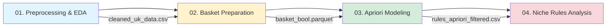
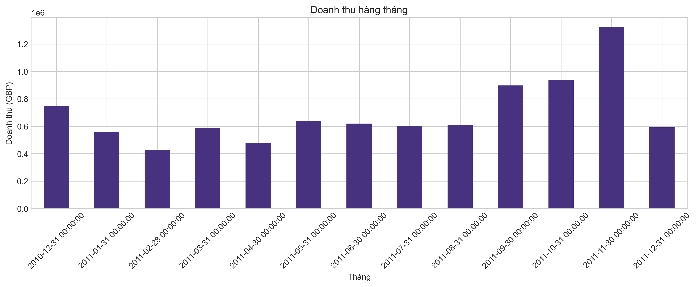
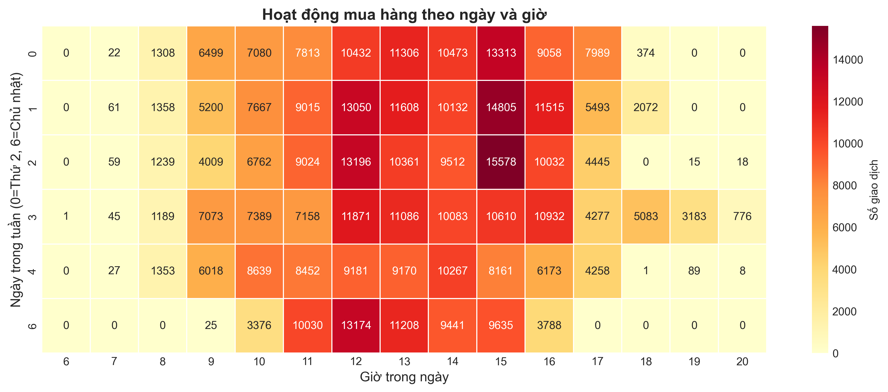
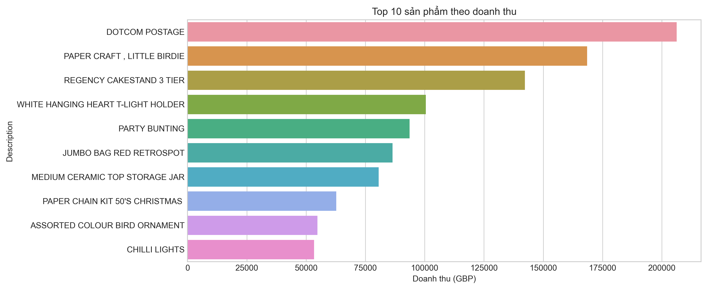
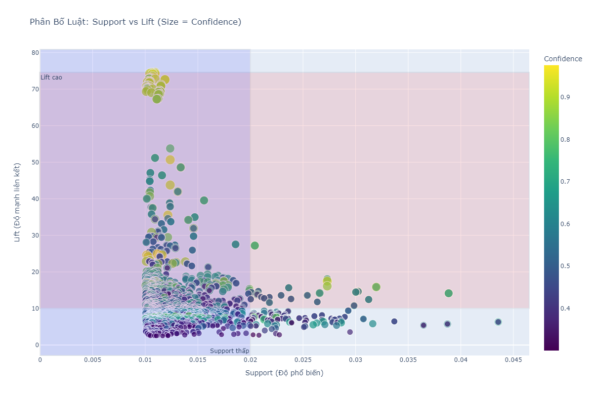
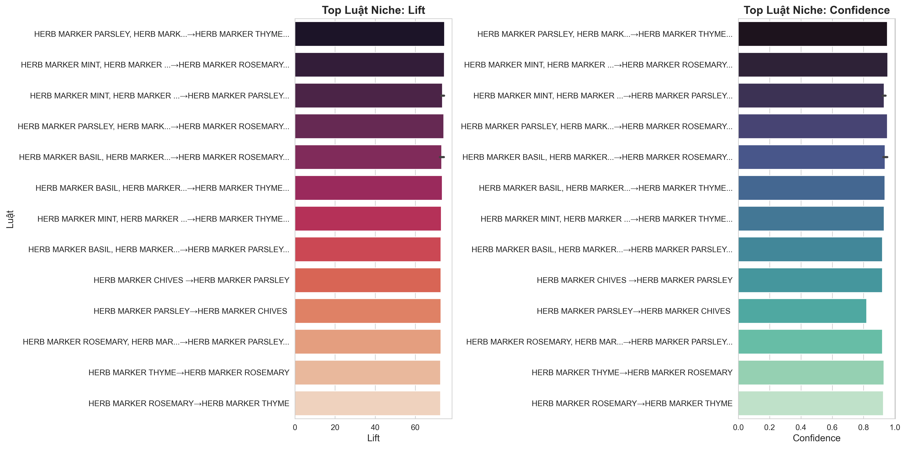

# 📦 Case Study: Phân tích Giỏ hàng với Apriori

## 👥 Thông tin Nhóm
- **Chủ đề:** Association Rule Mining - Khai phá luật kết hợp sản phẩm
- **Dataset:** Online Retail (UCI) 
- **Công nghệ:** Python, Pandas, MLxtend (Apriori), Papermill, Plotly

---

## 🎯 Mục tiêu 

Mục tiêu của project là **phân tích hành vi mua hàng của khách hàng** thông qua dữ liệu giao dịch bán lẻ, từ đó:

> - Tìm ra **các sản phẩm thường được mua cùng nhau** (frequent itemsets)
> - Khai thác **luật kết hợp** (association rules) với độ tin cậy cao
> - Đưa ra **gợi ý chiến lược kinh doanh** thực tế: cross-selling, bundle sản phẩm, sắp xếp kệ hàng
> - Xây dựng **pipeline tự động** có thể tái sử dụng cho các bộ dữ liệu khác

---

## 💡 1. Ý tưởng & Feynman Style

### Apriori dùng làm gì?

Hãy tưởng tượng bạn là chủ siêu thị và muốn biết:
- **Khách mua bánh mì thì thường mua thêm gì?**  
- **Nếu khách cho kem đánh răng vào giỏ, nên gợi ý sản phẩm nào tiếp theo?**

Thuật toán **Apriori** giúp trả lời những câu hỏi này bằng cách:

1. **Tìm tập sản phẩm phổ biến** (frequent itemsets): Những nhóm sản phẩm xuất hiện cùng nhau nhiều lần
2. **Sinh luật kết hợp** (association rules): Nếu mua A → thì thường mua B với xác suất bao nhiêu?
3. **Đánh giá chất lượng luật** qua 3 chỉ số:
   - **Support**: Tần suất xuất hiện của tập sản phẩm
   - **Confidence**: Xác suất mua B khi đã mua A  
   - **Lift**: Mức độ liên kết giữa A và B (>1 = có mối quan hệ tích cực)

### Tại sao phù hợp cho bài toán giỏ hàng?

- Dữ liệu giao dịch có dạng **giỏ hàng** (basket): mỗi hóa đơn chứa nhiều sản phẩm
- Apriori được thiết kế để tìm **patterns ẩn** trong dữ liệu dạng này
- Kết quả dễ hiểu, dễ áp dụng vào thực tế kinh doanh

### Ý tưởng thuật toán (đơn giản)

Apriori hoạt động theo nguyên lý **"nếu một tập sản phẩm phổ biến, thì tất cả tập con của nó cũng phổ biến"**. 

- Bước 1: Tìm các sản phẩm đơn lẻ phổ biến (support ≥ ngưỡng)
- Bước 2: Kết hợp thành cặp 2 sản phẩm, loại bỏ cặp không phổ biến
- Bước 3: Tiếp tục với bộ 3, bộ 4... cho đến khi không còn tập phổ biến nào
- Bước 4: Từ các tập phổ biến → sinh ra luật kết hợp

---

## 🔄 2. Quy trình Thực hiện

Dự án được chia thành **4 notebooks** chạy tuần tự qua pipeline tự động:



### Pipeline chi tiết:

| Bước | Notebook | Input | Output | Mục đích |
|------|----------|-------|--------|----------|
| **1** | `preprocessing_and_eda.ipynb` | `online_retail.csv` | `cleaned_uk_data.csv` | Làm sạch dữ liệu, EDA, RFM analysis |
| **2** | `basket_preparation.ipynb` | `cleaned_uk_data.csv` | `basket_bool.parquet` | Chuyển đổi sang ma trận Invoice × Product |
| **3** | `apriori_modelling.ipynb` | `basket_bool.parquet` | `rules_apriori_filtered.csv` | Khai thác frequent itemsets & rules |
| **4** | `ThuNghiem_ChuDe07.ipynb` | `rules_apriori_filtered.csv` | Phân tích chuyên sâu | Phân tích luật niche (support thấp, lift cao) |

### Chạy toàn bộ pipeline:

```bash
python run_papermill.py
```

Tất cả notebook sẽ được chạy tự động, kết quả lưu trong `notebooks/runs/`

---

## 🧹 3. Tiền xử lý Dữ liệu

### Dataset gốc: Online Retail (UCI)

- **Nguồn**: Công ty bán lẻ trực tuyến UK chuyên quà tặng độc đáo
- **Thời gian**: 01/12/2010 - 09/12/2011 (1 năm)
- **Kích thước gốc**: 541,909 giao dịch

### Các bước làm sạch:

| Bước | Thao tác | Lý do |
|------|----------|-------|
| 1️⃣ | Loại bỏ sản phẩm rỗng (Description = NaN) | Không xác định được sản phẩm |
| 2️⃣ | Loại bỏ hóa đơn hủy (InvoiceNo bắt đầu "C") | Giao dịch không thành công |
| 3️⃣ | Loại bỏ số lượng âm (Quantity < 0) | Dữ liệu lỗi hoặc trả hàng |
| 4️⃣ | Loại bỏ giá trị âm (UnitPrice < 0) | Dữ liệu không hợp lệ |
| 5️⃣ | Chỉ giữ lại khách hàng UK | Tập trung vào thị trường chính |
| 6️⃣ | Loại bỏ CustomerID = NaN | Không phân tích được hành vi |

### Thống kê sau làm sạch:

```
📊 Dữ liệu sau xử lý:
├─ Số giao dịch: 397,924 (giảm 26.6% so với gốc)
├─ Số khách hàng UK: 4,372 
├─ Số hóa đơn duy nhất: 18,532
├─ Số sản phẩm duy nhất: 3,958
├─ Thời gian: 01/12/2010 - 09/12/2011
└─ File output: data/processed/cleaned_uk_data.csv
```

### Trực quan hóa EDA

#### Doanh thu theo tháng


**Insight**: Doanh thu tăng mạnh vào tháng 11 (mùa Black Friday/Giáng sinh)

#### Patterns mua hàng theo giờ và ngày


**Insight**: Khách hàng mua sắm chủ yếu vào giờ hành chính (9h-17h), thứ 3-5

#### Top sản phẩm bán chạy


**Insight**: Sản phẩm decor và quà tặng chiếm tỷ trọng lớn

---

## 🛒 4. Chuẩn bị Ma trận Basket

Chuyển đổi dữ liệu giao dịch từ dạng:

```
InvoiceNo | StockCode | Description           | Quantity
536365    | 85123A    | WHITE HANGING HEART   | 6
536365    | 71053     | WHITE METAL LANTERN   | 6
536366    | 84406B    | CREAM CUPID HEARTS    | 8
```

Thành ma trận Boolean:

```
                      | WHITE HANGING HEART | WHITE METAL LANTERN | CREAM CUPID HEARTS | ...
InvoiceNo             |                     |                     |                    |
536365                | 1                   | 1                   | 0                  | ...
536366                | 0                   | 0                   | 1                  | ...
```

### Kết quả:

```
📦 Ma trận Basket:
├─ Kích thước: 18,532 invoices × 3,958 products
├─ Tỉ lệ ô = 1: 0.45% (ma trận rất thưa - sparse matrix)
├─ Số sản phẩm TB/hóa đơn: 17.8 items
└─ File output: data/processed/basket_bool.parquet
```

---

## ⚙️ 5. Áp dụng Apriori

### Tham số sử dụng:

```python
# Tham số khai thác frequent itemsets
MIN_SUPPORT = 0.01        # 1% = xuất hiện trong ít nhất 185 hóa đơn
MAX_LEN = 3               # Tối đa 3 sản phẩm/tập

# Tham số sinh luật
METRIC = "lift"           
MIN_THRESHOLD = 1.0       # Lift >= 1

# Tham số lọc luật
FILTER_MIN_SUPPORT = 0.01    # Support >= 1%
FILTER_MIN_CONF = 0.3        # Confidence >= 30%
FILTER_MIN_LIFT = 1.2        # Lift >= 1.2
```

### Triển khai code:

```python
from mlxtend.frequent_patterns import apriori, association_rules

# Bước 1: Tìm frequent itemsets
frequent_itemsets = apriori(
    basket_bool, 
    min_support=0.01, 
    use_colnames=True,
    max_len=3
)

# Bước 2: Sinh luật kết hợp
rules = association_rules(
    frequent_itemsets, 
    metric="lift", 
    min_threshold=1.0
)

# Bước 3: Lọc luật chất lượng cao
rules_filtered = rules[
    (rules['support'] >= 0.01) &
    (rules['confidence'] >= 0.3) &
    (rules['lift'] >= 1.2)
]
```

### Kết quả:

```
🔍 Kết quả khai thác:
├─ Frequent itemsets tìm được: 2,120 tập
│  ├─ Tập 1 sản phẩm: 394
│  ├─ Tập 2 sản phẩm: 1,458
│  └─ Tập 3 sản phẩm: 268
│
├─ Luật kết hợp ban đầu: 8,457 luật
└─ Luật sau lọc (quality rules): 1,796 luật
   ├─ Support: 0.01 - 0.12
   ├─ Confidence: 0.30 - 0.95
   └─ Lift: 1.2 - 74.57 (có luật lift cực cao!)
```

---

## 📊 6. Trực quan hóa (Visualization)

### 6.1. Top luật theo Lift


**Giải thích**: 
- Luật có **Lift cao nhất** (~74): Khi mua "HERB MARKERS" → rất có khả năng mua "HERB MARKER BUNDLE"
- Các luật liên quan đến bộ sản phẩm trang trí (SET, BUNDLE) có lift rất cao
- **Ứng dụng**: Đây là các sản phẩm nên đặt gần nhau trên kệ

### 6.2. Scatter: Support vs Confidence (màu = Lift)


**Giải thích**:
- **Góc trên-phải** (support cao, confidence cao): Luật phổ biến và đáng tin cậy
- **Góc dưới-phải** (support thấp, confidence cao): Luật niche - phân khúc khách hàng đặc biệt
- **Màu đỏ** (lift cao): Mối liên kết mạnh giữa sản phẩm
- **Ứng dụng**: Chọn luật phù hợp cho từng chiến lược marketing

### 6.3. Network Graph - Mạng lưới sản phẩm


**Giải thích**:
- Mỗi **node** = 1 sản phẩm
- Mỗi **cạnh có hướng** = 1 luật kết hợp (A → B)
- **Độ dày cạnh** tỷ lệ với Lift
- Các sản phẩm ở trung tâm = hub sản phẩm (nhiều liên kết)
- **Ứng dụng**: Xác định sản phẩm "trung tâm" để làm chiến dịch marketing

### 6.4. Phân tích Niche Rules (Support thấp, Lift cao)



**Vùng Niche** (support < 2%, lift > 10):
- Chỉ một nhóm nhỏ khách hàng mua nhưng liên kết cực mạnh
- Đây là **phân khúc thị trường chuyên biệt** (niche market)
- Tiềm năng giá trị cao do ít cạnh tranh



**Ví dụ luật niche tiêu biểu**:
```
HERB MARKERS THYME → HERB MARKER BUNDLE
├─ Support: 0.89% (164 hóa đơn)
├─ Confidence: 86%
├─ Lift: 74.57
└─ Insight: Khách mua thảo mộc thường mua cả bộ markers
```

---

## 💎 7. Insight từ Kết quả

### Insight #1: Sản phẩm Set/Bundle có liên kết mạnh nhất

**Phát hiện**: Top 20 luật có lift cao nhất đều liên quan đến bộ sản phẩm (SET, BUNDLE, KIT)

**Lý do**: 
- Khách hàng mua sản phẩm trang trí thường muốn bộ đồng bộ
- Tâm lý "mua đủ bộ" trong segment quà tặng

**Hành động**:
- ✅ Tạo combo "3 món giảm 15%" cho các sản phẩm cùng theme
- ✅ Thiết kế packaging "bộ quà tặng" cho dịp lễ

### Insight #2: Patterns theo mùa rõ ràng

**Phát hiện**: Doanh thu tháng 11 gấp 3 lần tháng thường

**Lý do**: Black Friday + chuẩn bị Giáng sinh

**Hành động**:
- ✅ Chuẩn bị inventory cho Q4 (tăng 200% so với TB)
- ✅ Chạy campaign "Gift Bundle" từ tháng 10
- ✅ Ưu tiên sản phẩm trang trí, quà tặng trong Q4

### Insight #3: Phân khúc Niche có giá trị cao

**Phát hiện**: 156 luật niche (support < 2%, lift > 10) chiếm 8.7% tổng luật

**Lý do**:
- Khách hàng chuyên nghiệp (như quán café, spa) mua sản phẩm niche
- Đơn giá cao, loyalty cao

**Hành động**:
- ✅ Tạo catalog riêng cho B2B customers
- ✅ Chương trình VIP cho nhóm này với ưu đãi đặc biệt
- ✅ Gợi ý sản phẩm bổ sung qua email marketing

### Insight #4: Giờ vàng mua hàng là 10h-15h

**Phát hiện**: 65% giao dịch diễn ra trong khung giờ 10h-15h

**Lý do**: Khách hàng chủ yếu là doanh nghiệp nhỏ, mua sắm trong giờ làm việc

**Hành động**:
- ✅ Tối ưu customer service cho khung giờ này
- ✅ Chạy flash sale vào 11h-12h để tăng conversion
- ✅ Schedule email marketing vào 9h sáng

### Insight #5: Cross-sell potential cực lớn

**Phát hiện**: 1,796 luật với confidence ≥ 30%, nhiều luật ≥ 80%

**Hành động**:
- ✅ Tích hợp "Frequently Bought Together" trên product page
- ✅ Email "You might also like" sau mua hàng
- ✅ Chatbot gợi ý sản phẩm khi khách thêm vào giỏ

---

## 🚀 8. Kết luận & Đề xuất Kinh doanh

### 📌 Chiến lược Cross-selling

**Triển khai "Frequently Bought Together"**:
```
Widget trên website:
┌────────────────────────────────────┐
│ ⭐ Frequently Bought Together      │
│                                    │
│ [✓] ALARM CLOCK BAKELIKE GREEN    │
│ [✓] ALARM CLOCK BAKELIKE RED      │
│ [✓] ALARM CLOCK BAKELIKE PINK     │
│                                    │
│ Buy all 3: £32.99 → £27.99 (15% OFF) │
└────────────────────────────────────┘
```

**KPI kỳ vọng**: Tăng 20% Average Order Value (AOV)

### 📌 Sắp xếp hàng trên kệ (Physical Store)

**Nguyên tắc**: Sản phẩm có lift cao đặt **gần nhau** hoặc **cùng kệ**

Ví dụ layout:
```
Kệ A: Herb & Garden Theme
├─ HERB MARKERS THYME
├─ HERB MARKERS ROSEMARY  
├─ HERB MARKER BUNDLE    ← đặt cùng kệ
└─ GARDEN TOOLS SET

Kệ B: Alarm Clock Collection
├─ ALARM CLOCK BAKELIKE GREEN
├─ ALARM CLOCK BAKELIKE RED
├─ ALARM CLOCK BAKELIKE PINK
└─ BATTERIES (complementary product)
```

### 📌 Khuyến mãi theo mùa

**Q4 Strategy (Oct-Dec)**:
- 🎁 Bundle deal: "Holiday Gift Set" với 3-5 sản phẩm theo theme
- 🎄 "12 Days of Christmas": Mỗi ngày 1 combo khác nhau
- 📦 Free gift wrapping cho đơn > £50

**Q1 Strategy (Jan-Mar)** - low season:
- 💡 "New Year Organization" bundle (storage, organizers)
- 🌸 "Spring Refresh" campaign cho home decor
- 📧 Reactive marketing cho khách hàng ngủ đông

### 📌 Personalization cho phân khúc Niche

**Segment B2B** (cafe, spa, boutique):
- 📋 Catalog riêng với bulk discount
- 🎯 Account manager dedicated
- 📦 Gợi ý restock tự động dựa trên lịch sử mua

**Segment Gift Lovers** (mua nhiều bundle):
- 🎁 Early access sale trước Black Friday
- 💌 Gift guide email theo dịp (Birthday, Wedding, Baby Shower)
- ⭐ Loyalty program với điểm thưởng gấp đôi cho bundle

---

## 🛠️ 9. Cài đặt & Chạy

### Yêu cầu hệ thống:
- Python 3.8+
- RAM: 4GB+ (để xử lý ma trận sparse)

### Cài đặt:

```bash
# Clone repository
git clone <repo_url>
cd DataMining_Week01

# Cài đặt dependencies
pip install -r requirements.txt
```

### Chạy từng notebook:

```bash
# Bước 1: Preprocessing
jupyter notebook notebooks/preprocessing_and_eda.ipynb

# Bước 2: Basket Preparation  
jupyter notebook notebooks/basket_preparation.ipynb

# Bước 3: Apriori Modeling
jupyter notebook notebooks/apriori_modelling.ipynb

# Bước 4: Niche Analysis
jupyter notebook notebooks/ThuNghiem_ChuDe07.ipynb
```

### Chạy toàn bộ pipeline (Khuyến nghị):

```bash
python run_papermill.py
```

Kết quả sẽ được lưu trong `notebooks/runs/` với timestamp.

### Thay đổi tham số:

Sửa file `run_papermill.py`:

```python
parameters = {
    "MIN_SUPPORT": 0.02,           # Tăng lên 2%
    "FILTER_MIN_LIFT": 2.0,        # Chỉ lấy luật lift >= 2
    "TOP_N_RULES": 30,             # Hiển thị 30 luật top
}
```

---

## 📚 10. Tech Stack

| Công nghệ | Phiên bản | Vai trò |
|-----------|-----------|---------|
| **Python** | 3.8+ | Ngôn ngữ lập trình chính |
| **Pandas** | 2.0+ | Xử lý dữ liệu tabular |
| **NumPy** | 1.24+ | Tính toán số học |
| **MLxtend** | 0.23+ | Thuật toán Apriori |
| **Matplotlib** | 3.7+ | Visualization tĩnh |
| **Seaborn** | 0.12+ | Statistical plots |
| **Plotly** | 5.15+ | Interactive charts |
| **NetworkX** | 3.1+ | Graph visualization |
| **Papermill** | 2.4+ | Notebook automation |
| **Jupyter** | - | Notebook environment |

---

## 🔮 11. Hướng phát triển

### Thuật toán:
- [ ] Thêm FP-Growth để so sánh performance
- [ ] Thử Sequential Pattern Mining (mua hàng theo thời gian)
- [ ] Clustering khách hàng trước khi mining rules

### Công nghệ:
- [ ] Streamlit dashboard để explore rules interactively
- [ ] API endpoint để gợi ý sản phẩm real-time
- [ ] Dockerize toàn bộ pipeline

### Kinh doanh:
- [ ] A/B testing để đo impact của cross-sell recommendations
- [ ] Tích hợp với CRM system
- [ ] Phân tích theo cohort (khách hàng mới vs cũ)

---

## 📄 12. License

MIT License - Sử dụng tự do cho mục đích học tập và nghiên cứu.
